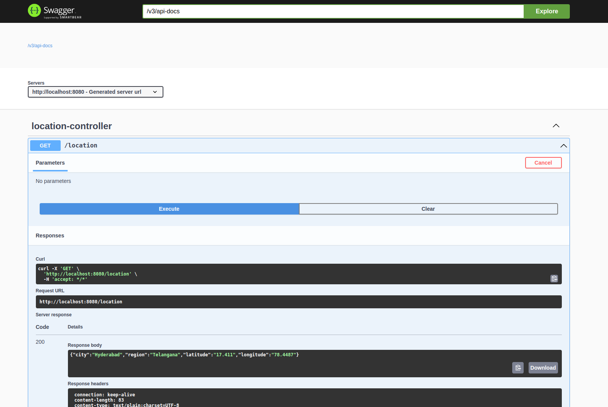
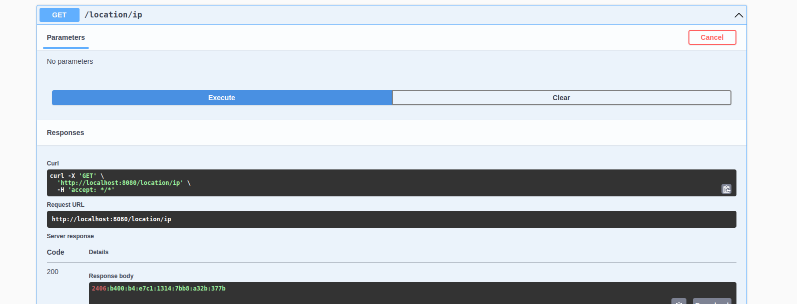

To track location of the user:

Exposed API's. 

> GET /location
>>  Jackson string object of class (Location) 
    attributes: city, region, latitude, longitude.

> GET /location/ip
>>  IP Address (ipv4/ipv6)

